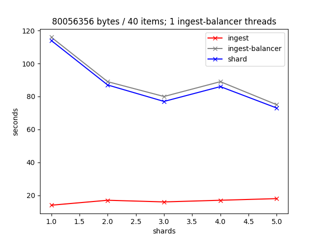
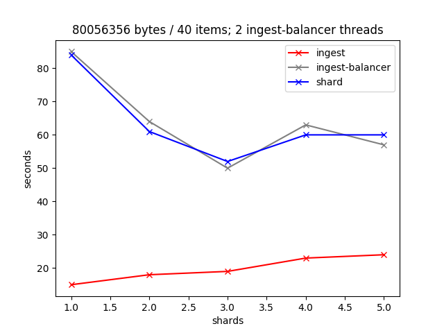
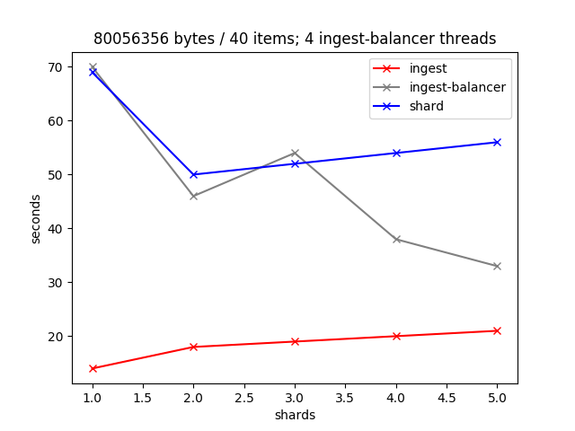
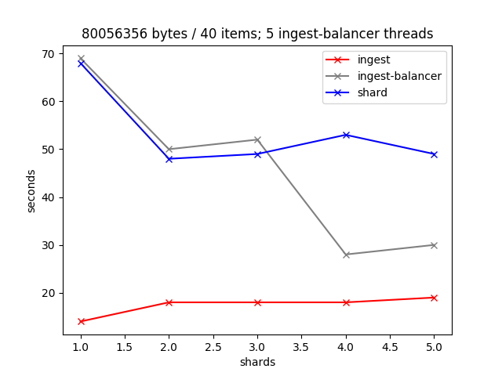

# xqa-perf  
* end to end performance metrics.
* see .travis.yml for a simple end to end test.
* run bin/e2e.sh to build a local end to end environment (assumes bin/build.sh run and xqa-test-data cloned).

## 1. Introduction
xqa-perf is a unit test - [test/xqa/perf_test.py](test/xqa/perf_test.py) - that easily, and reliably, demonstrates the core (ingest to shard) end to end performance of xqa.

The unit test involes multiple setup and teardown of containers, each involving multiple ingest-balancer threads and shards: it is a long running test that is very CPU intensive.

Throughout the test statistics are kept and, at various intervals, graphs are output into [test_results](test_results) (see below).

### 1.1. Environment
* CentOS 7 VM, running on a SSD with 10GB of RAM.
* 4 CPU cores.
* xqa-test-data - 40 XML files, ranging in size between 829 bytes and 14 MB.
* Host + Guest OS's in an idle state.

### 1.2. Test Result Graphs
The graphs reveal that xqa is most performant when the # of ingest-balancer threads is  +1 more than the # of cores and the # of shards is -1 the # of cores.

#### 1.2.1. Test Run: 1 ingest thread; 1 to 5 shards

#### 1.2.2. Test Run: 2 ingest threads; 1 to 5 shards

#### 1.2.3. Test Run: 3 ingest threads; 1 to 5 shards

#### 1.2.4. Test Run: 4 ingest threads; 1 to 5 shards

#### 1.2.5. Test Run: 5 ingest threads; 1 to 5 shards

## 2. Example Usage
Assuming [requirements.txt](requirements.txt) installed:

* export PYTHONPATH=$HOME/GIT_REPOS/xqa-perf/src:$HOME/GIT_REPOS/xqa-perf/test
* cd ~/GIT_REPOS/xqa-perf
* pytest -s

### 2.1. Sample output:

~~~~
============================= test session starts ==============================
platform linux -- Python 3.5.2, pytest-3.4.0, py-1.5.2, pluggy-0.6.0
rootdir: /home/jsears/GIT_REPOS/xqa-perf, inifile:
plugins: flake8-0.9.1, cov-2.5.1
collected 3 items

test/xqa/perf_test.py 2018-03-16 10:23:37,457      INFO --- [          MainThread]:            save_e2e_stats,  87: pool_size=3, shards=1; ingest_count=40; ingest_size=80056356; time_ingest=22; time_ingest_balancer=159; time_shard=152
2018-03-16 10:23:37,457      INFO --- [          MainThread]:            save_e2e_stats,  87: pool_size=3, shards=2; ingest_count=40; ingest_size=80056356; time_ingest=31; time_ingest_balancer=185; time_shard=178
2018-03-16 10:23:37,458      INFO --- [          MainThread]:            save_e2e_stats,  87: pool_size=3, shards=3; ingest_count=40; ingest_size=80056356; time_ingest=28; time_ingest_balancer=178; time_shard=171
2018-03-16 10:23:37,458      INFO --- [          MainThread]:            save_e2e_stats,  87: pool_size=3, shards=4; ingest_count=40; ingest_size=80056356; time_ingest=23; time_ingest_balancer=182; time_shard=175
2018-03-16 10:23:37,458      INFO --- [          MainThread]:                  make_png,  81: /tmp/pytest-of-jsears/pytest-6/test_png_produced_as_expected0/3_1-2-3-4.png
.2018-03-16 10:23:37,862      INFO --- [          MainThread]:            invoke_e2e_env,  19: pool_size=4; shards=1
2018-03-16 10:25:59,643      INFO --- [          MainThread]:            save_e2e_stats,  87: pool_size=4, shards=1; ingest_count=40; ingest_size=80056356; time_ingest=18; time_ingest_balancer=119; time_shard=112
2018-03-16 10:25:59,645      INFO --- [          MainThread]:                  make_png,  81: /tmp/pytest-of-jsears/pytest-6/test_perf_single_e2e0/3_1.png
.2018-03-16 10:26:00,080      INFO --- [          MainThread]:            invoke_e2e_env,  19: pool_size=1; shards=1
2018-03-16 10:31:24,321      INFO --- [          MainThread]:            save_e2e_stats,  87: pool_size=1, shards=1; ingest_count=40; ingest_size=80056356; time_ingest=13; time_ingest_balancer=281; time_shard=275
2018-03-16 10:31:24,322      INFO --- [          MainThread]:            invoke_e2e_env,  19: pool_size=1; shards=2
2018-03-16 10:36:18,157      INFO --- [          MainThread]:            save_e2e_stats,  87: pool_size=1, shards=2; ingest_count=40; ingest_size=80056356; time_ingest=13; time_ingest_balancer=248; time_shard=241
2018-03-16 10:36:18,158      INFO --- [          MainThread]:            invoke_e2e_env,  19: pool_size=1; shards=3
2018-03-16 10:41:12,145      INFO --- [          MainThread]:            save_e2e_stats,  87: pool_size=1, shards=3; ingest_count=40; ingest_size=80056356; time_ingest=12; time_ingest_balancer=245; time_shard=239
2018-03-16 10:41:12,151      INFO --- [          MainThread]:            invoke_e2e_env,  19: pool_size=1; shards=4
2018-03-16 10:46:05,515      INFO --- [          MainThread]:            save_e2e_stats,  87: pool_size=1, shards=4; ingest_count=40; ingest_size=80056356; time_ingest=12; time_ingest_balancer=244; time_shard=238
2018-03-16 10:46:05,521      INFO --- [          MainThread]:            invoke_e2e_env,  19: pool_size=1; shards=5
2018-03-16 10:50:45,977      INFO --- [          MainThread]:            save_e2e_stats,  87: pool_size=1, shards=5; ingest_count=40; ingest_size=80056356; time_ingest=13; time_ingest_balancer=237; time_shard=230
2018-03-16 10:50:45,983      INFO --- [          MainThread]:                  make_png,  81: /home/jsears/GIT_REPOS/xqa-perf/test_results/1_5.png
2018-03-16 10:50:46,302      INFO --- [          MainThread]:            invoke_e2e_env,  19: pool_size=2; shards=1
2018-03-16 10:53:59,158      INFO --- [          MainThread]:            save_e2e_stats,  87: pool_size=2, shards=1; ingest_count=40; ingest_size=80056356; time_ingest=11; time_ingest_balancer=161; time_shard=155
2018-03-16 10:53:59,159      INFO --- [          MainThread]:            invoke_e2e_env,  19: pool_size=2; shards=2
2018-03-16 10:56:54,672      INFO --- [          MainThread]:            save_e2e_stats,  87: pool_size=2, shards=2; ingest_count=40; ingest_size=80056356; time_ingest=11; time_ingest_balancer=134; time_shard=127
2018-03-16 10:56:54,673      INFO --- [          MainThread]:            invoke_e2e_env,  19: pool_size=2; shards=3
2018-03-16 10:59:59,497      INFO --- [          MainThread]:            save_e2e_stats,  87: pool_size=2, shards=3; ingest_count=40; ingest_size=80056356; time_ingest=15; time_ingest_balancer=142; time_shard=135
2018-03-16 10:59:59,498      INFO --- [          MainThread]:            invoke_e2e_env,  19: pool_size=2; shards=4
2018-03-16 11:02:48,163      INFO --- [          MainThread]:            save_e2e_stats,  87: pool_size=2, shards=4; ingest_count=40; ingest_size=80056356; time_ingest=14; time_ingest_balancer=132; time_shard=125
2018-03-16 11:02:48,164      INFO --- [          MainThread]:            invoke_e2e_env,  19: pool_size=2; shards=5
2018-03-16 11:05:36,826      INFO --- [          MainThread]:            save_e2e_stats,  87: pool_size=2, shards=5; ingest_count=40; ingest_size=80056356; time_ingest=12; time_ingest_balancer=126; time_shard=119
2018-03-16 11:05:36,833      INFO --- [          MainThread]:                  make_png,  81: /home/jsears/GIT_REPOS/xqa-perf/test_results/2_5.png
2018-03-16 11:05:37,146      INFO --- [          MainThread]:            invoke_e2e_env,  19: pool_size=3; shards=1
2018-03-16 11:08:16,979      INFO --- [          MainThread]:            save_e2e_stats,  87: pool_size=3, shards=1; ingest_count=40; ingest_size=80056356; time_ingest=13; time_ingest_balancer=129; time_shard=122
2018-03-16 11:08:16,980      INFO --- [          MainThread]:            invoke_e2e_env,  19: pool_size=3; shards=2
2018-03-16 11:10:27,605      INFO --- [          MainThread]:            save_e2e_stats,  87: pool_size=3, shards=2; ingest_count=40; ingest_size=80056356; time_ingest=13; time_ingest_balancer=95; time_shard=89
2018-03-16 11:10:27,607      INFO --- [          MainThread]:            invoke_e2e_env,  19: pool_size=3; shards=3
2018-03-16 11:12:38,383      INFO --- [          MainThread]:            save_e2e_stats,  87: pool_size=3, shards=3; ingest_count=40; ingest_size=80056356; time_ingest=13; time_ingest_balancer=96; time_shard=89
2018-03-16 11:12:38,388      INFO --- [          MainThread]:            invoke_e2e_env,  19: pool_size=3; shards=4
2018-03-16 11:14:44,127      INFO --- [          MainThread]:            save_e2e_stats,  87: pool_size=3, shards=4; ingest_count=40; ingest_size=80056356; time_ingest=13; time_ingest_balancer=94; time_shard=88
2018-03-16 11:14:44,128      INFO --- [          MainThread]:            invoke_e2e_env,  19: pool_size=3; shards=5
2018-03-16 11:16:49,789      INFO --- [          MainThread]:            save_e2e_stats,  87: pool_size=3, shards=5; ingest_count=40; ingest_size=80056356; time_ingest=14; time_ingest_balancer=96; time_shard=89
2018-03-16 11:16:49,795      INFO --- [          MainThread]:                  make_png,  81: /home/jsears/GIT_REPOS/xqa-perf/test_results/3_5.png
2018-03-16 11:16:50,097      INFO --- [          MainThread]:            invoke_e2e_env,  19: pool_size=4; shards=1
2018-03-16 11:19:00,863      INFO --- [          MainThread]:            save_e2e_stats,  87: pool_size=4, shards=1; ingest_count=40; ingest_size=80056356; time_ingest=13; time_ingest_balancer=103; time_shard=97
2018-03-16 11:19:00,869      INFO --- [          MainThread]:            invoke_e2e_env,  19: pool_size=4; shards=2
2018-03-16 11:20:53,619      INFO --- [          MainThread]:            save_e2e_stats,  87: pool_size=4, shards=2; ingest_count=40; ingest_size=80056356; time_ingest=14; time_ingest_balancer=85; time_shard=78
2018-03-16 11:20:53,624      INFO --- [          MainThread]:            invoke_e2e_env,  19: pool_size=4; shards=3
2018-03-16 11:22:39,750      INFO --- [          MainThread]:            save_e2e_stats,  87: pool_size=4, shards=3; ingest_count=40; ingest_size=80056356; time_ingest=13; time_ingest_balancer=70; time_shard=63
2018-03-16 11:22:39,756      INFO --- [          MainThread]:            invoke_e2e_env,  19: pool_size=4; shards=4
2018-03-16 11:24:33,042      INFO --- [          MainThread]:            save_e2e_stats,  87: pool_size=4, shards=4; ingest_count=40; ingest_size=80056356; time_ingest=14; time_ingest_balancer=75; time_shard=69
2018-03-16 11:24:33,048      INFO --- [          MainThread]:            invoke_e2e_env,  19: pool_size=4; shards=5
2018-03-16 11:26:16,112      INFO --- [          MainThread]:            save_e2e_stats,  87: pool_size=4, shards=5; ingest_count=40; ingest_size=80056356; time_ingest=15; time_ingest_balancer=71; time_shard=64
2018-03-16 11:26:16,118      INFO --- [          MainThread]:                  make_png,  81: /home/jsears/GIT_REPOS/xqa-perf/test_results/4_5.png
2018-03-16 11:26:16,466      INFO --- [          MainThread]:            invoke_e2e_env,  19: pool_size=5; shards=1
2018-03-16 11:28:26,975      INFO --- [          MainThread]:            save_e2e_stats,  87: pool_size=5, shards=1; ingest_count=40; ingest_size=80056356; time_ingest=13; time_ingest_balancer=92; time_shard=86
2018-03-16 11:28:26,976      INFO --- [          MainThread]:            invoke_e2e_env,  19: pool_size=5; shards=2
2018-03-16 11:29:59,251      INFO --- [          MainThread]:            save_e2e_stats,  87: pool_size=5, shards=2; ingest_count=40; ingest_size=80056356; time_ingest=15; time_ingest_balancer=61; time_shard=59
2018-03-16 11:29:59,257      INFO --- [          MainThread]:            invoke_e2e_env,  19: pool_size=5; shards=3
2018-03-16 11:31:32,042      INFO --- [          MainThread]:            save_e2e_stats,  87: pool_size=5, shards=3; ingest_count=40; ingest_size=80056356; time_ingest=15; time_ingest_balancer=55; time_shard=55
2018-03-16 11:31:32,047      INFO --- [          MainThread]:            invoke_e2e_env,  19: pool_size=5; shards=4
2018-03-16 11:33:14,229      INFO --- [          MainThread]:            save_e2e_stats,  87: pool_size=5, shards=4; ingest_count=40; ingest_size=80056356; time_ingest=15; time_ingest_balancer=67; time_shard=60
2018-03-16 11:33:14,234      INFO --- [          MainThread]:            invoke_e2e_env,  19: pool_size=5; shards=5
2018-03-16 11:34:57,192      INFO --- [          MainThread]:            save_e2e_stats,  87: pool_size=5, shards=5; ingest_count=40; ingest_size=80056356; time_ingest=15; time_ingest_balancer=65; time_shard=58
2018-03-16 11:34:57,198      INFO --- [          MainThread]:                  make_png,  81: /home/jsears/GIT_REPOS/xqa-perf/test_results/5_5.png
.

========================= 3 passed in 4280.74 seconds ==========================
~~~~
