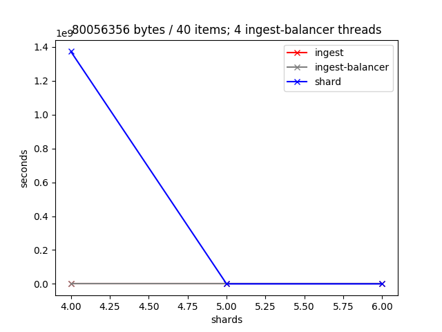

# xqa-perf [](https://travis-ci.org/jameshnsears/xqa-perf) 
* end to end performance metrics / environment construction.
    * .travis.yml shows a simple end to end test, using containers build from source.

## 1. Introduction
xqa-perf is composed of two parts:
* a python **Unit Test** - [test/xqa/perf_test.py](test/xqa/perf_test.py) - that matplotlib's end to end performance of xqa using the xqa-test-data.
* a set of **bash Scripts** - [bin](bin) called by the unit test but that can also be used standalone to provision / publish the containers.

### 1.1. Unit Test
The unit test, which you run manually, involes multiple setup and teardown of containers, each with varying ingest-balancer threads and shards: it is a long running test that is very CPU intensive. Throughout the test statistics are kept and, at various intervals, graphs are output into [test_results](test_results) (see below).

#### 1.1.1. Usage
Assuming [requirements.txt](requirements.txt) installed; bin/build.sh run and xqa-test-data cloned.

```
export DEVPATH=$HOME/GIT_REPOS
export PYTHONPATH=$DEVPATH/xqa-perf/src:$DEVPATH/xqa-perf/test:$PYTHONPATH
export PATH=$DEVPATH/xqa-perf/bin:$PATH
cd $DEVPATH/xqa-perf
pytest -s &> ~/Desktop/xqa-perf.log &
tail -f ~/Desktop/xqa-perf.log
```

### 1.2. Bash Scripts
* Run [bin/e2e.sh](bin/e2e.sh) to build a local end to end environment.

## 2. Test Environment
* CentOS 7 VM, running on a SSD with 8GB of RAM.
* 4 logical cores.
* Host + Guest OS's in an idle state.

## 3. Unit Test Results - Matplotlib's Graphs
* each ingest thread has 5s to receive responses from shard(s).

### 3.1. Test: 1 ingest thread; 1 to 6 shards


### 3.2. Test: 2 ingest threads; 1 to 6 shards


### 3.3. Test: 3 ingest threads; 1 to 6 shards


### 3.4. Test: 4 ingest threads; 1 to 6 shards

