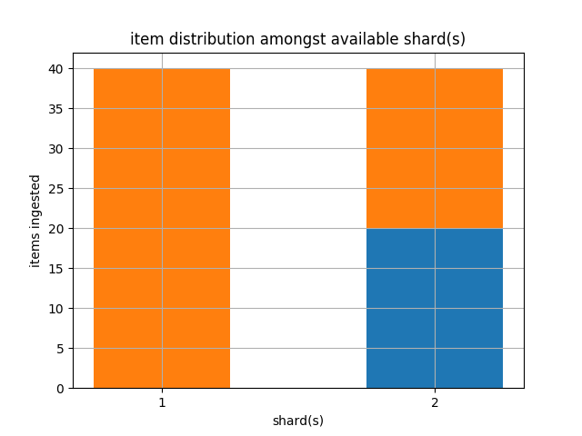
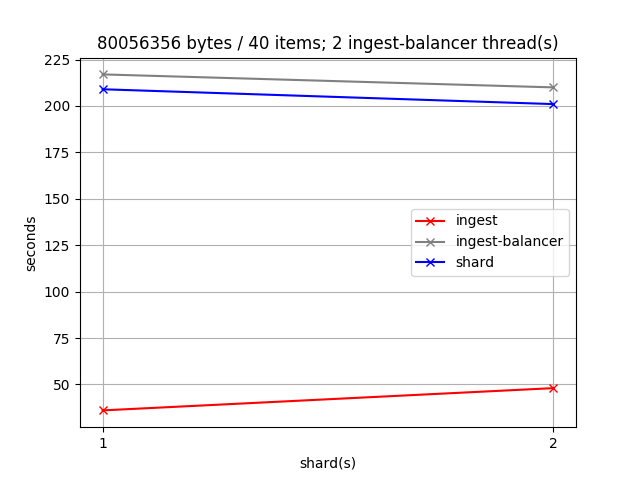
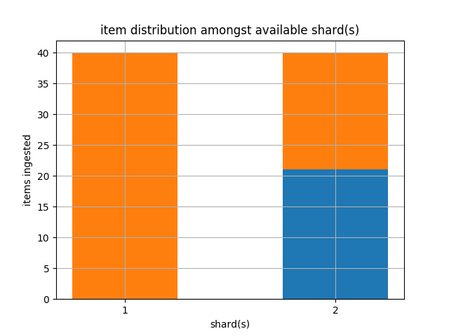

# xqa-perf [](https://travis-ci.org/jameshnsears/xqa-perf) 
* environment construction / end to end performance metrics.
* .travis.yml shows a simple end to end test, using containers build from source.

## 1. Introduction
xqa-perf is composed of two parts:
* a set of stand alone **bash Scripts** - [bin](bin) that provision / publish the containers.
* a python **Unit Test** - [test/xqa/perf_test.py](test/xqa/perf_test.py) - that produces matplotlib graphs showing end to end performance of xqa using the xqa-test-data.

The bash scripts are also used by the end to end performance metric unit test.

## 2. Bash Scripts
* Run [bin/e2e.sh](bin/e2e.sh) to build a local environment built from GitHub source clones.

## 3. Unit Test
The unit test involves the multiple setup and teardown of containers - based on the CPU count of the host. Each setup / teardown uses a different # of ingest-balancer threads as well as # of shards: it is a long running test that is very CPU intensive. Throughout the test statistics are kept and, at various intervals, graphs are output into the [test_results](test_results) folder (see below).

### 3.1. Usage
Assuming [requirements.txt](requirements.txt) installed; bin/build.sh run and xqa-test-data cloned.

```
export DEVPATH=$HOME/GIT_REPOS
export PYTHONPATH=$DEVPATH/xqa-perf/src:$DEVPATH/xqa-perf/test:$PYTHONPATH
export PATH=$DEVPATH/xqa-perf/bin:$PATH
cd $DEVPATH/xqa-perf
pytest -s &> ~/Desktop/xqa-perf.log &
tail -f ~/Desktop/xqa-perf.log
```

## 4. Test Results
* Ubuntu 18.04 VM, running on a SSD.
* Host + Guest OS's in an idle state.

### 4.1. 5GB RAM; 2 logical cores

#### 4.1.1. 1 ingest thread; 1 to 2 shards
| System Timing Stats | Shard Item Distribution |
| ------------- | ------------- |
|  |   |

#### 4.1.2. 2 ingest threads; 1 to 2 shards
| System Timing Stats | Shard Item Distribution |
| ------------- | ------------- |
|  |   |

### 4.2. 8GB RAM; 4 logical cores

#### 4.2.1. 1 ingest thread; 1 to 4 shards
| System Timing Stats | Shard Item Distribution |
| ------------- | ------------- |
|  |   |

#### 4.2.2. 2 ingest threads; 1 to 4 shards
| System Timing Stats | Shard Item Distribution |
| ------------- | ------------- |
|  |   |

#### 4.2.3. 3 ingest threads; 1 to 4 shards
| System Timing Stats | Shard Item Distribution |
| ------------- | ------------- |
|  |   |

#### 4.2.4. 4 ingest threads; 1 to 4 shards
| System Timing Stats | Shard Item Distribution |
| ------------- | ------------- |
|  |   |
