# xqa-perf    
* end to end integration tests, with Matplotlib graphs.

## 1. Test Results
XQA allows you to easily experiment with it's operating parameters:
* the # of BaseX engines (xqa-shards).
* the # of ingest clients (xqa-ingest-balancer's pool_size).
* how long each ingest client waits for a xqa-shard size response  (xqa-ingest-balancer's insert_thread_wait & insert_thread_secondary_wait)

This ability to experiment is important as it let's you tune XQA to match your requirements.

In general though, the "best" overall scalability & performance is achieved when the # of BaseX engines and ingest client's is less than the maximum # of host CPU cores. 

By reviewing the graphs below, from a worst case ingest using a single BaseX engine, we can achieve somewhere between a 250% to 400% improvement in performance by using XQA.

### 1.1. Test Data
* Each test run used all the .xml files from [xqa-test-data](https://github.com/jameshnsears/xqa-test-data).

## 2. Test # 1 - Dell Laptop
* Ubuntu 18.04
* Memory: 7.7 GiB
* Processor: Intel® Core™ i5-3340M CPU @ 2.70GHz × 4
* Disk: 2.5" SSD

Ingest thread(s) | Shard(s) | Timing statistics | XML file distribution |
| ------------- | ------------- | ------------- | ------------- |
| 1 | 1 | 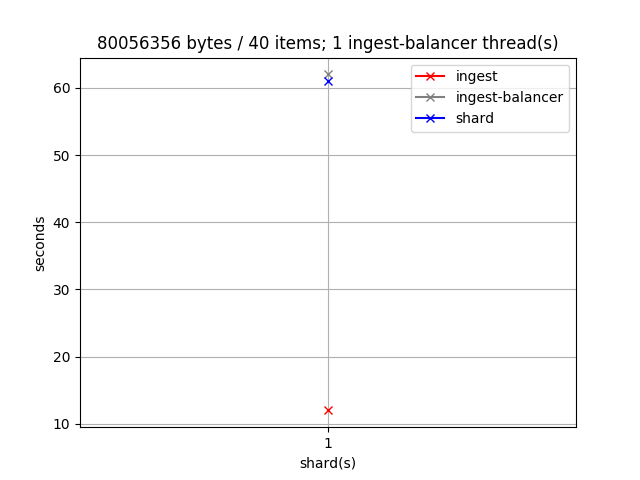 | 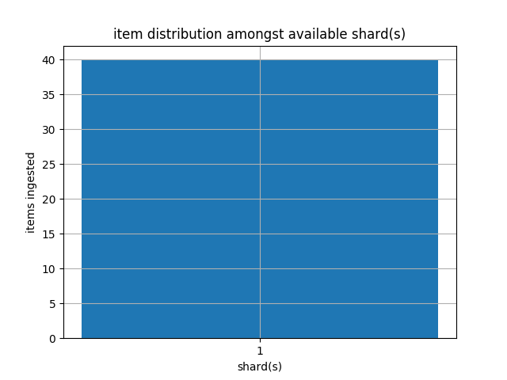 |
| 2 | 1 - 4 | 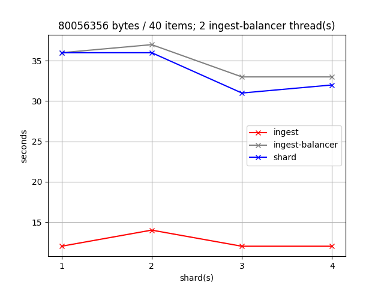 | 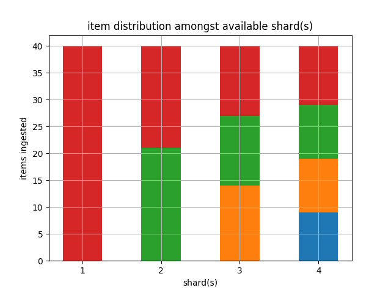 |
| 4 | 1 - 4 | 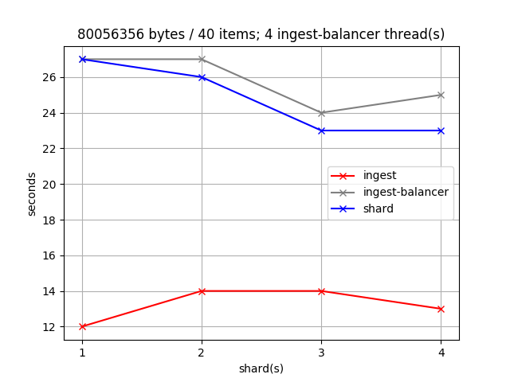 | 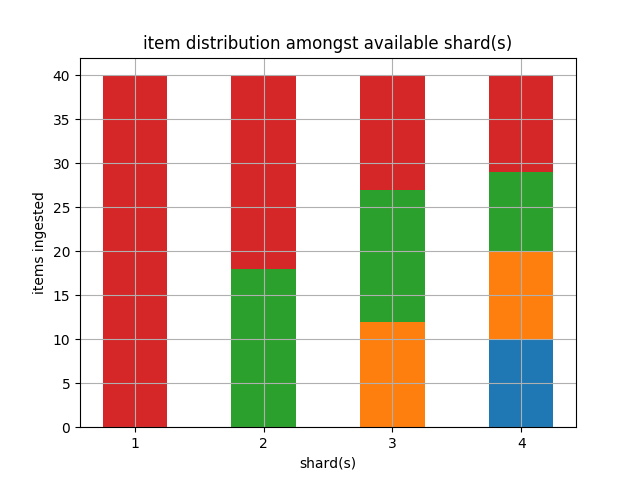 |

## 3. Test # 2 - MSI Laptop
* Ubuntu 18.04
* Memory: 15.6 GiB
* Processor: Intel® Core™ i7-5700HQ CPU @ 2.70GHz × 8 
* Disk: M.2 SSD

Ingest thread(s) | Shard(s) | Timing statistics | XML file distribution |
| ------------- | ------------- | ------------- | ------------- |
| 1 | 1 |  |  |
| 2 | 1 - 8 |  | 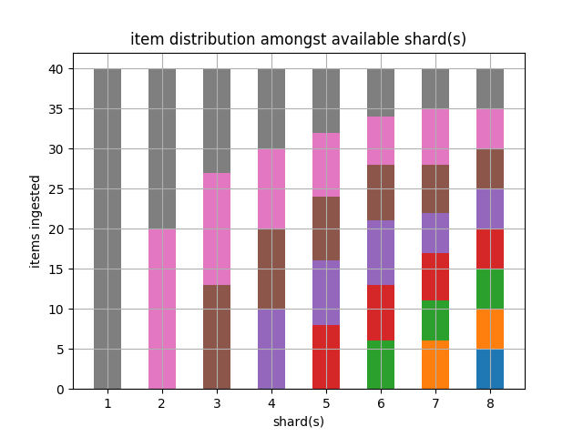 |
| 4 | 1 - 8 | 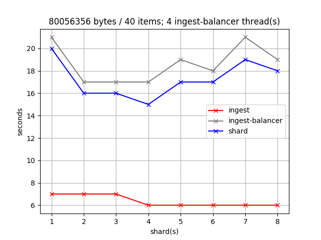 | 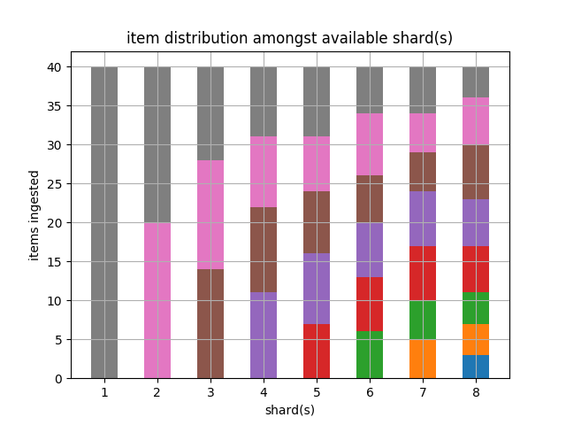 |
| 8 | 1 - 8 | 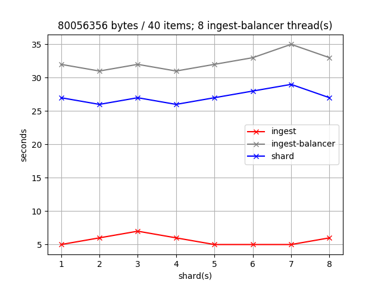 | 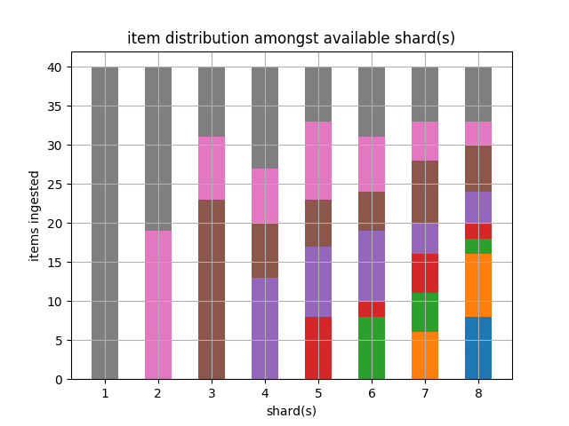 |
