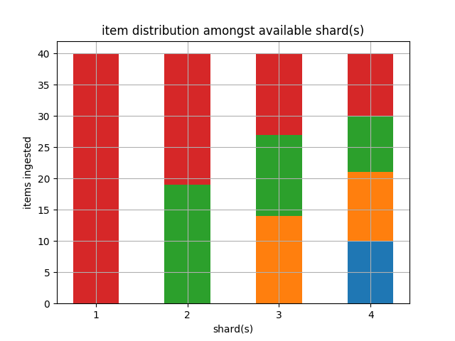
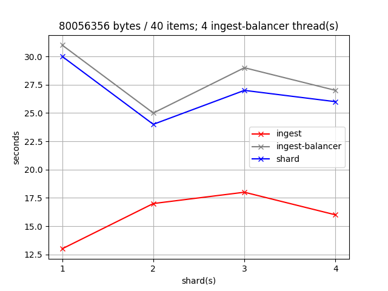
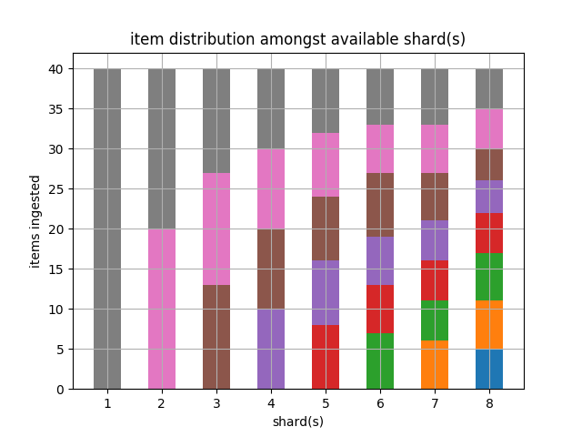
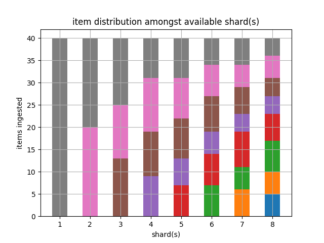

# xqa-perf  
* end to end integration tests, with Matplotlib graphs.

## 1. Test Results
To get the best scalability & performance improvements the following is important:
* the # of BaseX engines
    * the xqa-shard's
* the # of clients
    * the size of thread_pool in xqa-ingest-balancer
* how long each client waits for a response from the xqa-message-broker:
    * the duration of insert_thread_secondary_wait in xqa-ingest-balancer

Two thing's are also important:

### 1.1. Worst Case Scenario
The worst case scenario, 1 ingest thread and 1 shar, isn't too shabby 

### 1.1. Test # 1 - Dell Laptop
* Ubuntu 18.04
* Memory: 7.7 GiB
* Processor: Intel® Core™ i5-3340M CPU @ 2.70GHz × 4
* Disk: 2.5" SSD#

Ingest thread(s) | Shard(s) | Timing statistics | XML file distribution |
| ------------- | ------------- | ------------- | ------------- |
| 1 | 1 |  |  |
| 2 | 1 - 4 |  |  |
| 4 | 1 - 4 |  |  |

### 1.2. Test # 1 - MSI Laptop
* Ubuntu 18.04
* Memory: 15.6 GiB
* Processor: Intel® Core™ i7-5700HQ CPU @ 2.70GHz × 8 
* Disk: M.2 SSD

Ingest thread(s) | Shard(s) | Timing statistics | XML file distribution |
| ------------- | ------------- | ------------- | ------------- |
| 1 | 1 |  |  |
| 2 | 1 - 8 |  |  |
| 4 | 1 - 8 |  |  |
| 8 | 1 - 8 |  |  |
